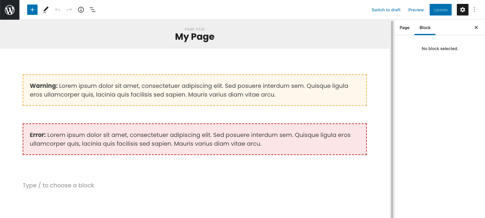
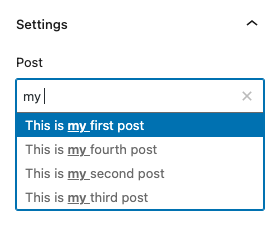
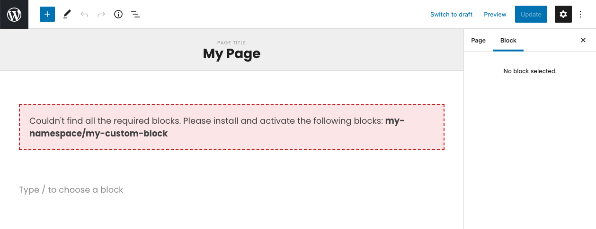
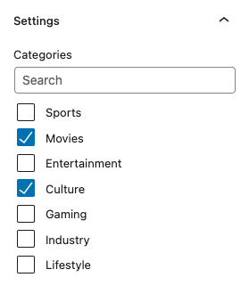

# WP Block Toolkit

A simple collection of useful tools for WordPress Gutenberg block building.

## Styles

To include the editor styles, currently you need to add this to the top of your Gutenberg block's `_editor.scss`:

`@import "~@tnke/wp-block-toolkit/build/index.css";`

In the future, we'll figure out a better way to manage CSS in the toolkit.

## Components

### InlineNotice

Compliments the base WordPress notice system by allowing you to show either warning or error level notices inside the editor.



```javascript
<InlineNotice level="error">
	<strong>Error: </strong> Lorem ipsum dolor sit amet.
</InlineNotice>
```

### PostControl

Advanced ComboboxControl for selecting a single post, with search filtering feature.



```javascript
<PostControl
	label={"My Label"}
	value={mySelectedPostId}
	posts={myPosts}
	onChange={(value) =>
		setAttributes({
			mySelectedPostId: value,
		})
	}
/>
```

### RequireBlocks

Allows you to only show components if certain blocks are installed and activated in the system. If some of the blocks are missing, displays an error instead using an `InlineNotice`.



```javascript
<RequireBlocks blocks={["core/paragraph", "my-namespace/my-custom-block"]}>
	<h2>My title</h2>
	<p>Lorem ipsum dolor sit amet, consectetuer adipiscing elit.</p>
	<MyComponent />
</RequireBlocks>
```

### TaxonomyControl

Similar to the default WordPress category selector, shows a filterable list of checkboxes.



```javascript
<TaxonomyControl
	label={"My Label"}
	value={mySelectedTaxonomies}
	taxonomies={myTaxonomies}
	onChange={(value) => setAttributes({ mySelectedTaxonomies: value })}
/>
```

## Hooks

### useAllPosts

QoL wrapper for getting all posts of a certain post type, ordered alphabetically by title.

```javascript
const stories = useAllPosts("story");
const contacts = useAllPosts("contact");
```

### useRequiredBlocks

Checks if the listed block names are installed and activated on the site. Also returns the list of missing block names if you wish to list them in an error message for example.

```javascript
const { missingBlocks, hasRequiredBlocks } = useRequiredBlocks([
	"core/paragraph",
	"core/image",
]);
```

## Changelog

### 2.0.2

- Added "prepare" script
- Refactored PostControl: core ComboboxControl now has query filtering built-in, no need to manually do it like in the official docs.

### 2.0.1

- Optimized readme assets

### 2.0.0

- Changed the name of PostSelectControl component and the postValue prop (breaking changes)
- Added descriptions of the different tools to the readme

### 1.0.8

- Style tweaks for TaxonomyControl
- Added a `config.json` file

### 1.0.7

- Added preliminary typescript typings

### 1.0.0 - 1.0.6

- Initial release
